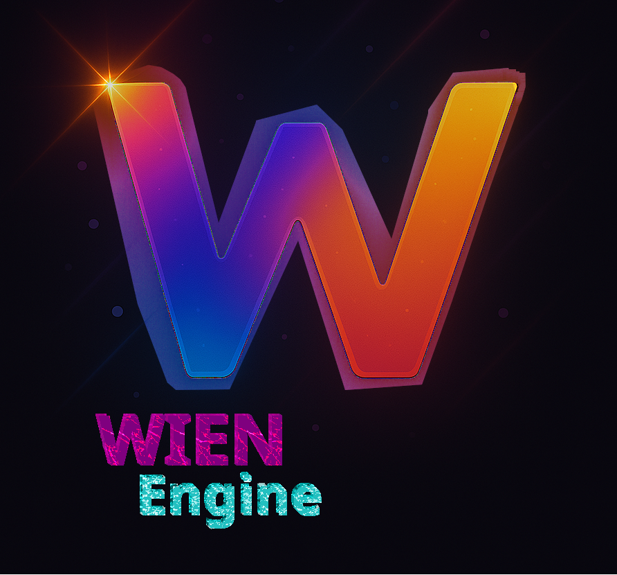
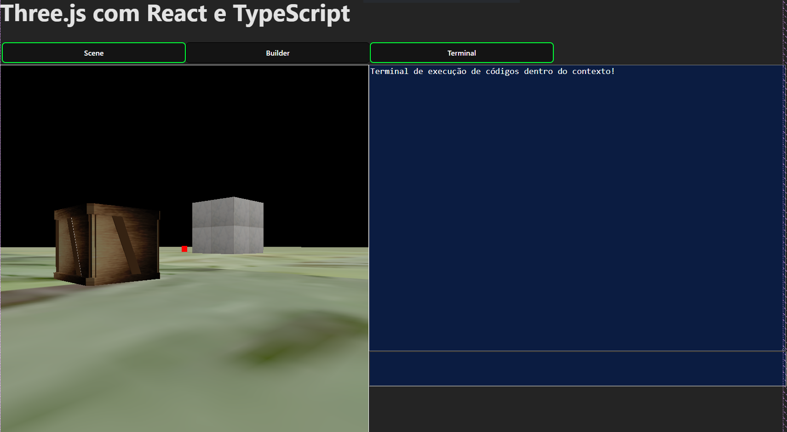
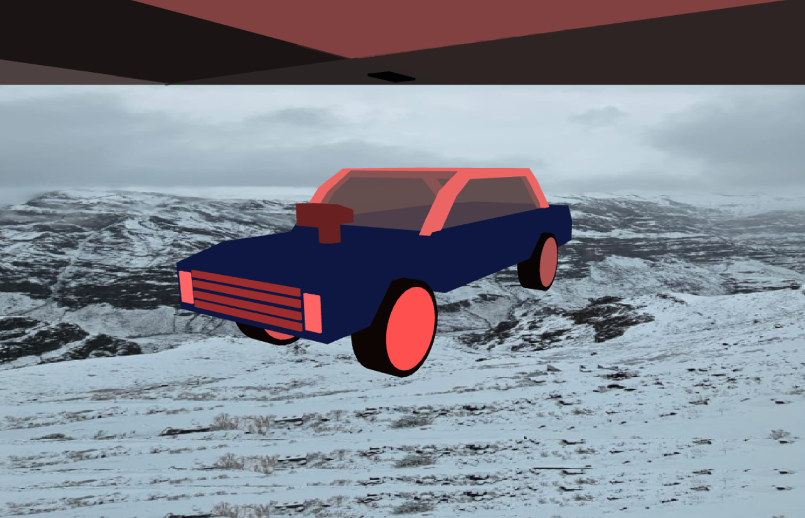

## Engine

    

## Apresentação
Uma pequena Game Engine construida em JavaScript.

## Estado dela

    

    

## Dependências
Este projeto utiliza o [Three.js](https://threejs.org/) como motor de renderização 3D.  
O Three.js está licenciado sob a licença MIT.  

