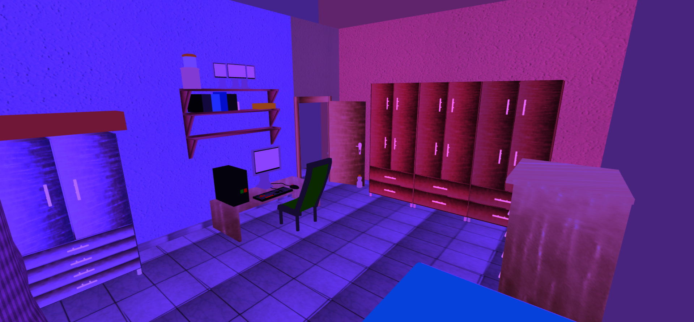

## Engine 
### Current Version: alpha1.0.0.6

    

## Apresentação
Uma pequena Game Engine construida em JavaScript.

## Estado dela

    

    

## Licença
Este é um projeto pessoal de **William Alves Jardim**, iniciado em **2025**, desenvolvido por diversão, e está protegido por direitos autorais e licenciado sob os termos da [Creative Commons BY-NC-ND 4.0](https://creativecommons.org/licenses/by-nc-nd/4.0/).  
Veja o arquivo `LICENSE` para mais detalhes.

Esta licença se aplica a todos os meus códigos, imagens, áudios, anotações, materiais e conteúdos, que estão presentes neste repositório ou que estão identificados com o meu nome.
Este projeto não tem nenhum fim comercial ou profissional.

Os cabeçalhos dos meus arquivos — quando identificados com meu nome — estão escritos em português, com alguns termos em inglês, como `AUTHOR` e `LICENSE`.

## Dependências externas (AVISO DE REMOÇÃO DE DEPENDENCIA)

⚠️ A partir da versão `alpha1.0.0.6` [neste commit](https://github.com/WilliamJardim/Engine/commit/e95c59de65fc42a4585bd96d1516029723dce285), este projeto **não utiliza mais o Three.js**.

Versões anteriores usaram o [Three.js](https://threejs.org/) como motor de renderização 3D, instalado via NPM e licenciado sob [MIT License](https://github.com/mrdoob/three.js/blob/dev/LICENSE). O código do Three.js nunca foi incluído diretamente neste repositório.

Atualmente, o projeto utiliza um **renderizador WebGL próprio**, desenvolvido por mim do zero, especificamente para este projeto, sem qualquer dependência ou derivação do Three.js.

